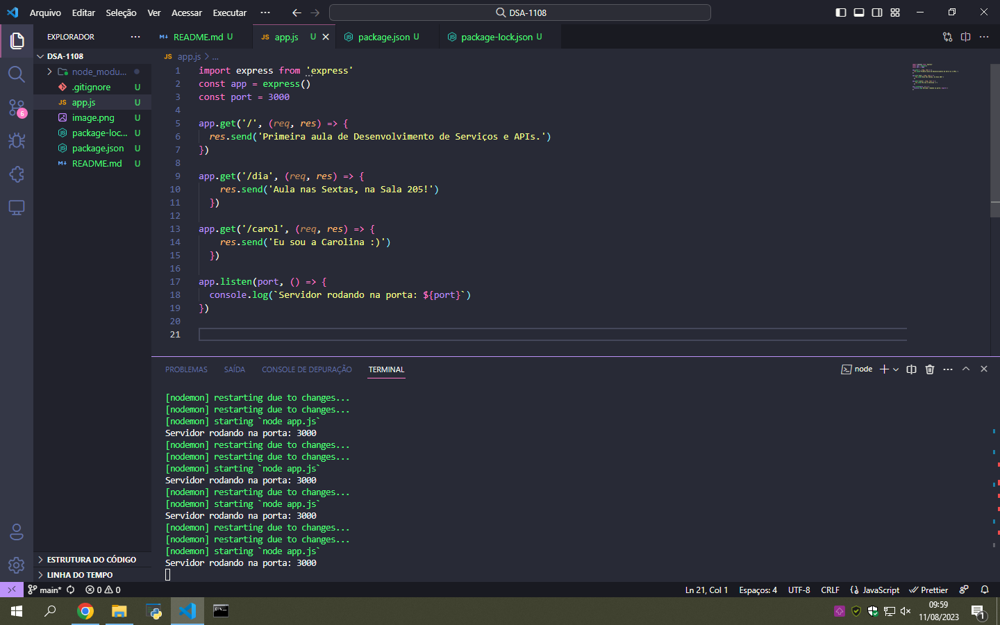
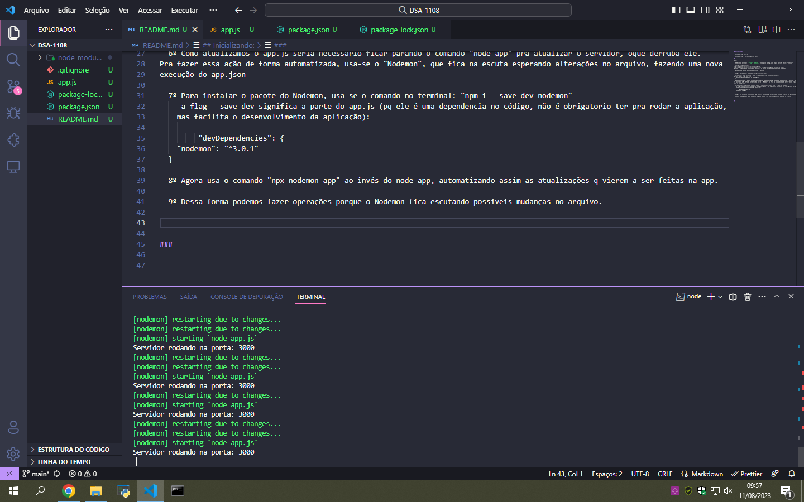
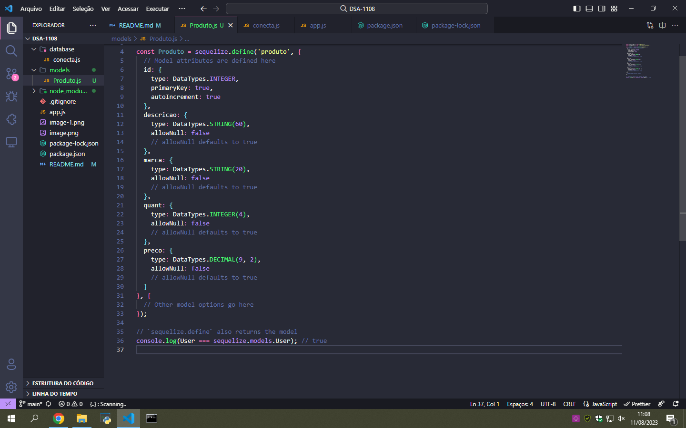
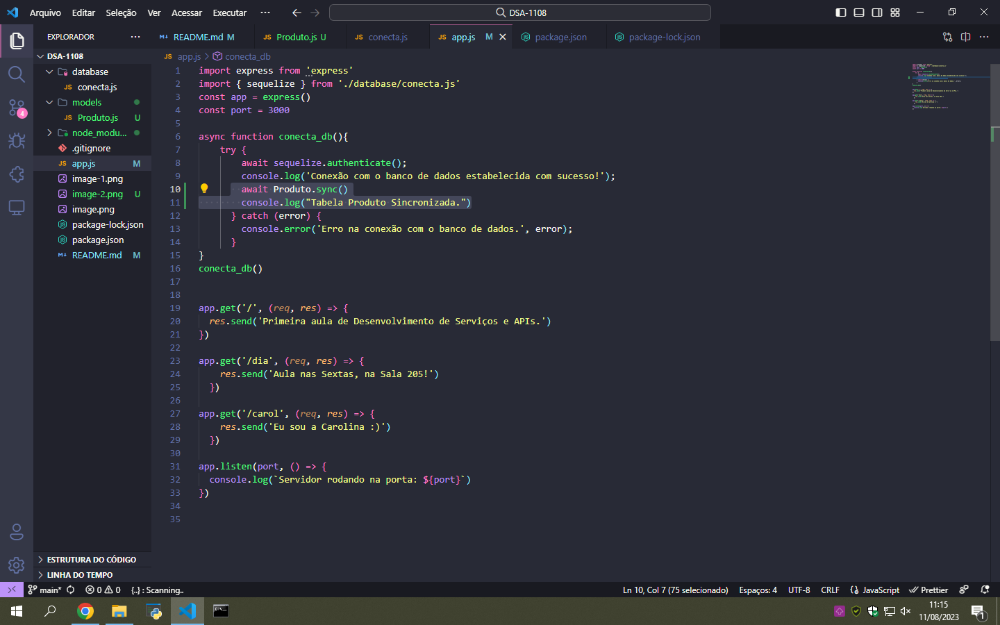

## Inicializando:

* 1º comando: `` npm init -y `` 

* 2º comando: `` npm i express sequelize mysql2 `` 

###

## Feito isso: 

- 1º Adicionar a linha =  ` "type": "module", ` no arquivo package.json depois da linha "main": "index.js"

- 2º https://expressjs.com/
https://expressjs.com/en/starter/installing.html
https://expressjs.com/en/starter/hello-world.html // Copiar o código do hello world example
Adiciona a linha `` import express from 'express'``  no início do código e tira a linha de const do express

- 3º roda `` node app `` no terminal pra iniciar o servidor

- 4º Agora basta acessar no browser: http://localhost:3000/

- 5º Pode criar novas rotas com a mesma formatação das rotas existentes, exemplo:

>                app.get('/dia', (req, res) => {
>            res.send('Aula nas Sextas, na Sala 205!')
>          })

  Agora basta acessar no browser: http://localhost:3000/dia

- 6º Como atualizamos o app.js seria necessário ficar parando o comando "node app" pra atualizar o servidor, o que derruba ele. 
Pra fazer essa ação de forma automatizada, usa-se o "Nodemon", que fica na escuta esperando alterações no arquivo, fazendo uma nova
execução do app.json

- 7º Para instalar o pacote do Nodemon, usa-se o comando no terminal: ``npm i --save-dev nodemon``
    _a flag "--save-dev" significa a parte do app.js (pq ele é uma dependencia no código, não é obrigatorio ter pra rodar a aplicação, mas facilita o desenvolvimento da aplicação):  
    
>           "devDependencies": {
>          "nodemon": "^3.0.1"
>        }

- 8º Agora usa o comando ``npx nodemon app`` no terminal ao invés do *node app*, automatizando assim as atualizações que vierem a ser feitas na app.

- 9º Dessa forma podemos fazer operações porque o Nodemon fica escutando possíveis mudanças no arquivo.

###

## Integração de Banco de dados:

Existem algumas formas de Trabalhar com Banco de Dados, mas na disciplina usaremos:
 - Utilizar um package que define modelos de objetos associados às tabelas – o mapeamento objeto relacional (ORM). 
 
  #### Primeiro passo: 

  1. Iniciar o MySQL em um terminal separado do terminal do app.js
  2. Comando ``mysql -u <aluno> -p`` 
  3. Cria o banco de dados com o ``create database estoque;``
  4. Conectar a aplicação com o banco de dados criado com o Sequelize:

  * Cria a pasta "database e o arquivo "conecta.js"

  * Acessa o https://sequelize.org/docs/v6/getting-started/
      Copia o bloco de início e deixa assim:

          > import { Sequelize } from "sequelize";
          >
          > const sequelize = new Sequelize('estoque', 'aluno', 'senacrs', {
          >    host: 'localhost',
          >    dialect: 'mysql',
          >    port: 3306
          >  });

  5. No arquivo "app.js", adiciona a função conecta_db e cola o bloco de código do site do Sequelize de teste de conexão.

          > async function conecta_db(){
          > try {
          >    await sequelize.authenticate();
          >    console.log('Connection has been established successfully.');
          >  } catch (error) {
          >    console.error('Unable to connect to the database:', error);
          >  }
      >}
      >
      >conecta_db()

  6. Adiciona a linha "import { sequelize } from './database/conecta.js'" no arquivo app.js abaixo do import do express.

  7. No arquivo conecta.js adicionar a palavra "export" antes da linha "const sequelize = new Sequelize....."
    Assim, o terminal com o nodemon precisa estar aparecendo a mensagem da função conecta_db, se mudar a senha no conecta.js, o
    erro deve aparecer no terminal. Se tiver com as credenciais de forma correta vai autorizar o acesso ao bd no servidor.

### 

## Modelos

Cria uma pasta chamada "Models" e cria um arquivo "Produto.js" para inserir os modelos básicos da doc do Sequelize:

``
>          import { DataTypes } from 'sequelize';
>          import { sequelize } from '../database/conecta.js';
>
>          const User = sequelize.define('User', {
>            // Model attributes are defined here
>            firstName: {
>              type: DataTypes.STRING,
>              allowNull: false
>            },
>            lastName: {
>              type: DataTypes.STRING
>              // allowNull defaults to true
>            }
>          }, {
>            // Other model options go here
>          });
``

Transforma a const pro "Produto" e define os dados direitinho das tabelas, assim:

No arquivo do app.js, adiciona as linhas de sincronia do Produtos.js pro banco de dados sincronizar a tabela criada nesse model Sequelize:

Agora basta ir no terminal com o MySQL e dar o show tables; pra ver a tabela Produto criada.

No MySQL, insere os produtos da tabela. **Não esquecer os campos "createdAt" e "updatedAt":
`` insert into produtos(descricao, marca, quant, preco, createdAt, updatedAt) values("Pão de Sanduíche", "Pullman", 23, 8.00, now(), now()); ``

## Rotas

No site do Express (https://expressjs.com/en/guide/routing.html), buscar o código do express.Route e colar num novo arquivo chamado
"routes.js", que vai conter todas as rotas da nossa aplicação, esse arquivo fica na raíz e deve ser alterado pra ficar dessa forma:

``
import express from 'express';
const router = express.Router()

// define the home page route
router.get('/produtos', )

export default router
`` 

## Controles
- Cria outra pasta chamada de "Controllers" e o arquivo "produtoController.js"

`` 
import { Produto } from "../models/Produto.js"

export const produtoIndex = (req, res) => {
    //obtém todos os dados da model (tabela) produto
    const produtos = Produto.findAll()
    // retorna (responde) com os dados obtidos no formato json
    res.status(200).json(produtos)
}
``
- Que serve pra colocar os dados/produtos e enviar pro front depois, por exemplo.

